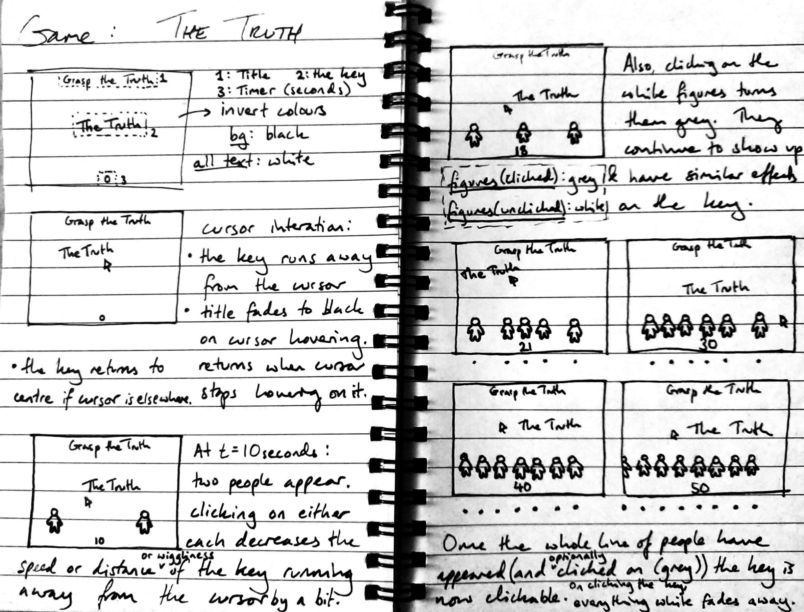

# the-truth
A python game.
New features to come...

Information about Pygame used:
https://www.pygame.org/docs/
http://pygametutorials.wikidot.com/tutorials-basic
https://www.patternsgameprog.com/series/discover-python-and-patterns/
https://www.pygame.org/docs/tut/newbieguide.html
https://stackoverflow.com/questions/30720665/countdown-timer-in-pygame

To be looked at for fading:
https://stackoverflow.com/questions/58540537/how-to-fade-the-screen-out-and-back-in-using-pygame

Sketch Plan: 

Change 1: I decided to make the timer count in intervals of 1.4 seconds, rather than by 1 second, so the game feels ever so slightly unsettling.

Change 2: Instead of making the erraticness of "the Truth" (i.e. the key) moving away from the cursor decrease as the game progresses, I've changed the behaviour of the key in other ways. This is because the original idea won't show noticible changes between each stage. At a certain game stage, I have coded that "the Truth" goes round in a circle in 12 stages like numbers on a clock, which is another reference to how a person's perception of grasping the truth changes over the passing of time.

